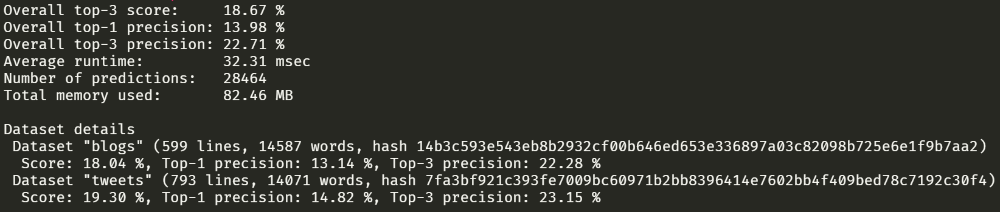

```{r setup, include=FALSE}
options(htmltools.dir.version = FALSE)
```

```{r xaringan-themer, include=FALSE, warning=FALSE}
library(xaringanthemer)
style_duo(primary_color = "#003049", #"#1F4257", 
          secondary_color = "#F77F00", #"#F97B64", 
          header_font_google = google_font("Arvo"),
          text_font_google   = google_font("Lato", "300", "300i"),
          code_font_family = "Fira Code",
          code_font_url = "https://cdn.jsdelivr.net/gh/tonsky/FiraCode@2/distr/fira_code.css"
          )
```

# What it does

The **[WordPredictR](https://kpatelis.shinyapps.io/jhu_ds_capstone/)** application showcases our implementation of an algorithm to predict the next word in a partly typed sentence

- Simply start typing a sentence, press **Space**, and observe the app come up with the **five** words most probable to continue the sentence

- You can click on a word from the generated table and that word will be added to the typed sentence

- After a word is inserted, the algorithm will use the new sentence as its input and predict the next set of possible words that follow

---
# How it works

- The application implements the **[Stupid Backoff](https://www.aclweb.org/anthology/D07-1090.pdf)** algorithm

- The algorithm works best when trained on a large scale of data

- Dictionary of ngrams is pre-trained, up to **5grams** and stored in a list of tables

- The entirety of the tweet, blog and news corpora were used to train the model and the tables were **trimmed** to remove ngrams with low counts

- A lookup table with a binary index was implemented to increase the speed of looking up predictions

- The final size of the trained model is **16.7 Mb** when saved using the **.Rds** format

---
# How it performs

Using the publicly available **[benchmarking tool](https://github.com/hfoffani/dsci-benchmark)** we achieve the following results:

```{r performance, echo=FALSE}



```

---
# Next version

The next version of the app will have the following improvements:

- Alternative language models are trained (**Interpolated Kneser Ney smoothing**) and the user has the ability to select which to use

- The application is more **mobile-friendly**

